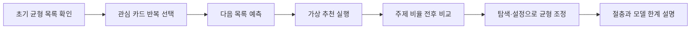

# Recommendation Balance Lab

> 한국어 서비스명: **추천 알고리즘 균형 실험실**  
> 문서 상태: 설계 확정 전 검토본 · 구현하지 않음  
> 작성일: 2026-08-26

## 1. 프로젝트 개요

| 항목 | 설계 내용 |
|---|---|
| 대상 | 초등 5~6학년 |
| 교과 | 실과·도덕·디지털 시민성 |
| 핵심 질문 | 내가 반복해서 고른 정보가 다음 추천의 구성을 어떻게 바꾸며, 다양성을 되찾으려면 무엇을 조절할 수 있을까요? |
| 한 차시 권장 시간 | 30~40분 |
| 실행 형태 | 실제 플랫폼과 연결되지 않는 결정적 가상 추천 모델 |
| 핵심 산출물 | 추천 분포 전후 비교, 균형 조정안, 모델 한계 설명 |

학생은 가상의 관심 카드에 반응하면서 추천 목록의 주제 비율이 어떻게 변하는지 관찰합니다. 반복 선택이 다음 목록을 좁히는 피드백 고리를 눈으로 확인한 뒤, `새 주제 탐색`, `관심 기록 조정`, `다양성 슬라이더` 같은 학습용 장치로 관련성과 다양성 사이의 절충을 비교합니다.

## 2. 설계 원칙

- 실제 유튜브·SNS·검색 서비스의 알고리즘을 재현하거나 성능을 주장하지 않습니다.
- 앱의 모든 추천 규칙과 가중치 변화를 학생에게 공개합니다.
- “알고리즘은 나쁘다”가 아니라 선택, 콘텐츠 공급, 설정, 무작위성이 함께 결과에 영향을 줄 수 있음을 단순 모형으로 다룹니다.
- 학생의 실제 관심사, 검색 기록, 계정 정보를 수집하지 않습니다.
- 사용 습관이나 중독 여부를 진단하지 않고 추천 구성에 대한 비판적 이해만 다룹니다.

## 3. 교육과정 연계와 학습 목표

- `[6실05-05]`: 인공지능이 만들어지는 과정을 체험하고 사회에 미치는 영향 탐색
- `[6실05-04]`: 데이터의 유형과 형태, 인공지능 활용 데이터 탐색
- 책임 있는 선택과 다양한 관점 존중에 관한 디지털 시민성 확장 활동

| 수준 | 학습 목표 |
|---|---|
| 이해 | 추천이 미리 정한 규칙과 관찰된 선택 자료를 이용할 수 있음을 설명합니다. |
| 적용 | 반복 선택 뒤 주제 비율 변화를 읽습니다. |
| 분석 | 관련성 증가와 다양성 감소가 동시에 나타나는 경우를 비교합니다. |
| 평가·설계 | 목적에 맞는 균형 조정안을 만들고 모형의 한계를 밝힙니다. |

## 4. 기존 앱과의 차별성

| 비교 대상 | 기존 앱의 중심 | 이 앱의 고유 중심 |
|---|---|---|
| AI 데이터 품질검사소 | 기록의 누락·중복·오류 정비 | 선택과 추천 분포 사이의 피드백 고리 관찰 |
| 디지털 사용 습관 활동 | 시간·행동을 돌아보고 조절 | 추천 규칙과 정보 다양성의 관계 실험 |
| 팩트체크 편집국 | 개별 주장과 외부 근거 비교 | 목록 전체에서 어떤 주제가 반복 노출되는지 분석 |

## 5. 핵심 학습 흐름

## 6. 가상 추천 모델

MVP는 설명 가능한 단순 규칙을 사용합니다.

- 콘텐츠는 과학, 예술, 스포츠, 자연, 역사 등 중립적 가상 주제 태그를 가집니다.
- 학생이 한 주제를 선택하면 해당 주제의 `관심 토큰`이 1개 늘어납니다.
- 다음 목록은 기본 토큰, 관심 토큰, 다양성 토큰을 합쳐 정해진 비율로 구성합니다.
- 동일한 입력은 동일한 결과를 내며, 모든 계산 근거를 `왜 이 카드가 나왔나요?`에서 보여 줍니다.
- 실제 추천 시스템은 훨씬 복잡하며 이 모델이 특정 서비스의 동작을 설명하지 않는다는 경고를 항상 표시합니다.

정밀한 확률 수치 대신 카드 수와 상대 막대로 변화를 표현하여 실제 정확도로 오해하지 않게 합니다.

## 7. 미션 구성

| 미션 | 활동 | 핵심 질문 |
|---|---|---|
| 1. 선택의 흔적 | 같은 주제 카드를 세 번 고른 뒤 다음 목록 예측 | 반복 선택이 어떤 자료로 남았는가 |
| 2. 좁아진 창 | 초기 목록과 변화한 목록의 주제 수 비교 | 관련성과 다양성이 어떻게 달라졌는가 |
| 3. 탐색 버튼 | 낯선 주제 카드 한 장을 의도적으로 열기 | 한 번의 탐색이 이후 구성에 미치는 영향 |
| 4. 균형 조정 | 다양성·관심 기록 설정을 바꾸어 세 목록 비교 | 목적마다 어떤 절충이 적절한가 |
| 5. 모델 감사 | 같은 선택인데 공급 목록이 다를 때 결과 비교 | 사용자 선택 외 어떤 조건이 영향을 주는가 |

## 8. 화면 및 정보 구조

| 화면 | 주요 요소 | 학생 행동 |
|---|---|---|
| 실험 안내 | 가상 모델 표지, 목표, 개인정보 안내 | 미션 시작 |
| 추천 피드 | 가상 카드 8장, 주제 라벨, 선택 버튼 | 카드 선택 |
| 규칙 투명창 | 현재 토큰과 목록 구성 규칙 | 다음 결과 예측 |
| 분포 비교실 | 전후 카드 수, 상대 막대, 빠진 주제 | 변화 문장 완성 |
| 균형 조절대 | 탐색·기록 초기화·다양성 조절 | 설정 비교 |
| 모델 보고서 | 선택·설정·공급 조건·한계 | 근거 정리 |

실제 피드처럼 끝없이 스크롤하지 않으며 미션마다 카드 수를 고정합니다.

## 9. 피드백과 평가

| 평가 요소 | 성취 증거 |
|---|---|
| 변화 읽기 | 선택 전후 주제 구성을 자료로 비교함 |
| 인과 구분 | 선택, 설정, 공급 목록의 영향을 구분함 |
| 절충 판단 | 관련성과 다양성 중 목적에 맞는 균형을 설명함 |
| 한계 인식 | 가상 모형을 실제 플랫폼 전체로 일반화하지 않음 |

하나의 `가장 공정한 비율`을 정답으로 두지 않습니다. “새로운 주제를 찾는 목적”과 “이미 아는 주제를 깊게 보는 목적”에 따라 다른 설정을 타당하게 인정합니다.

## 10. UI·접근성 설계

- 주제는 색뿐 아니라 이름·아이콘·무늬로 구분합니다.
- 카드는 선택 버튼으로 조작하며 드래그나 스와이프를 요구하지 않습니다.
- 현재 필수 버튼 `다음 목록 예측`, `균형 비교`에만 `gi-pulse`를 적용합니다.
- 모션 감소 설정에서는 카드 재배치 애니메이션을 전후 표로 대체합니다.
- 막대그래프에는 카드 수와 문장 요약을 함께 제공하고 스크린 리더용 표를 제공합니다.
- 무한 스크롤, 자동 재생, 자극적인 알림 효과를 사용하지 않습니다.

## 11. 기술 구조 설계

- Vite + React + TypeScript 기반 정적 SPA를 권장합니다.
- 콘텐츠 카드, 태그, 추천 규칙, 설명 문구를 UI와 분리합니다.
- 결정적 난수 시드 또는 완전 결정 규칙으로 수업 중 결과를 재현할 수 있게 합니다.
- 서버, 로그인, 쿠키 기반 추적, 실제 플랫폼 API, 외부 AI를 사용하지 않습니다.
- 선택 기록은 기본적으로 탭 안에서만 유지하고 초기화 버튼을 항상 제공합니다.

## 12. 개인정보·윤리·모델 한계

- 실제 취향, 정치·종교·건강 정보와 같은 민감 주제를 수집하거나 사례로 쓰지 않습니다.
- 학생 행동을 프로파일링하거나 교사에게 개인 순위를 전송하지 않습니다.
- 결과 화면에 `가상의 단순 규칙이며 실제 서비스 추천을 판정하지 않습니다`를 표시합니다.
- 필터 버블을 개인 탓으로만 돌리지 않고 시스템 설계와 콘텐츠 공급 조건도 함께 제시합니다.
- 학생이 불편한 실제 콘텐츠를 신고·차단할 때는 보호자·교사와 플랫폼의 공식 도움 기능을 이용하도록 일반 안내만 제공합니다.

## 13. MVP 범위

### 포함

- 중립 주제 5종, 가상 카드 40개
- 반복 선택, 다음 목록 예측, 전후 분포 비교
- 탐색·기록 초기화·다양성 조절 실험
- 규칙 공개 패널과 모델 한계 보고서

### 제외

- 실제 추천 플랫폼 연동
- 실제 사용자 기록·쿠키·계정
- 생성형 AI 콘텐츠 추천
- 사용 시간 진단, 중독 판정, 온라인 공유

## 14. 완료 기준

- 모든 추천 카드에 선택 결과가 나온 이유를 확인할 수 있습니다.
- 같은 초기 상태와 선택은 항상 재현 가능한 결과를 냅니다.
- 학생이 선택 이외의 조건도 추천 구성에 영향을 줄 수 있음을 확인합니다.
- 하나의 균형 비율만 정답으로 채점하지 않습니다.
- 375px 모바일, 키보드, 모션 감소, 스크린 리더용 분포 표에서 전체 활동을 완료합니다.

## 15. 업데이트 내역 버튼 설계

화면 오른쪽 아래의 작은 `업데이트 내역` 버튼에서 가상 추천 규칙, 콘텐츠 묶음, 모델 한계 문구의 변경을 공개합니다.

| 날짜 | 구분 | 내역 |
|---|---|---|
| 2026-08-26 | 설계 | 최초 설계 문서 작성 |
| 구현일 입력 예정 | 개발 | MVP 구현과 디지털 시민성 검수 후 실제 날짜 기록 |

## 16. 이번 문서의 경계

가상 추천 모형과 학습 경험만 설계했습니다. 추천 엔진 코드, 실제 데이터 연동, 테스트, 배포, Hong's Vibe Coding Lab 등록은 진행하지 않습니다.
