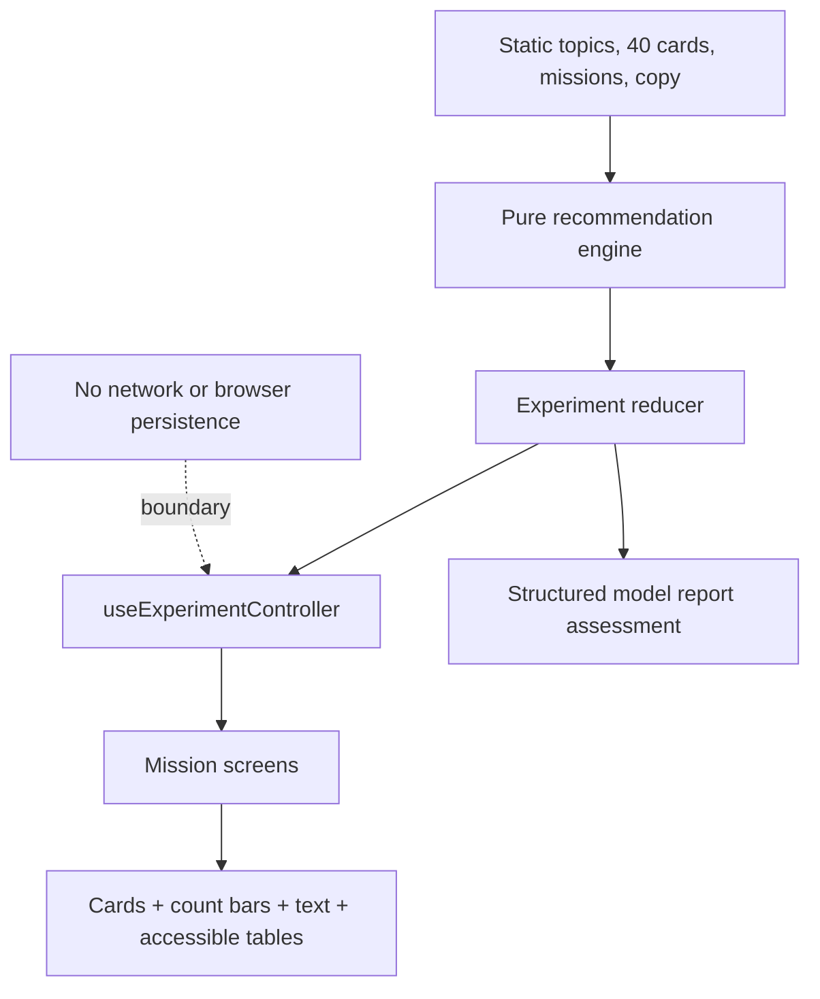

# Recommendation Balance Lab Implementation Plan

> **For agentic workers:** REQUIRED SUB-SKILL: Use superpowers:subagent-driven-development (recommended) or superpowers:executing-plans to implement this plan task-by-task. Steps use checkbox (`- [ ]`) syntax for tracking.

**Goal:** 초등 5~6학년 학생이 가상의 반복 선택, 추천 분포 변화, 탐색·기록·다양성 설정, 공급 조건을 순서대로 비교하고 관련성과 다양성의 절충 및 단순 모형의 한계를 근거와 함께 설명하는 결정적 정적 웹앱을 만든다.

**Architecture:** 정적 콘텐츠와 도메인 규칙을 React 화면에서 분리하고, 순수 TypeScript 추천 엔진과 상태 리듀서가 모든 결과와 단계 전이를 결정한다. `useExperimentController`가 도메인 함수와 화면을 연결하며, UI는 추천 결과를 카드 수·상대 막대·문장·표로 동시에 표현한다. 모든 학생 기록은 React 메모리에만 존재하고 네트워크·브라우저 저장소·외부 플랫폼 연결은 사용하지 않는다.

**Tech Stack:** Node.js `24.15.0`, npm, Vite `8.2.2`, React/React DOM `19.2.8`, TypeScript `6.0.3`, Vitest `4.1.11`, Testing Library, Playwright `1.62.1`, `@axe-core/playwright` `4.13.0`, CSS Modules 없이 책임별 전역 CSS 파일

**Spec:** `/Volumes/ External Drive 256G/Dev2/codex/recommendation-balance-lab/2026-08-26-recommendation-balance-lab-design.md`

## Global Constraints

- 대상은 초등 5~6학년, 교과는 실과·도덕·디지털 시민성이며 한 차시는 30~40분 안에 완료되어야 한다.
- 교육과정 연결은 `[6실05-05]` 인공지능 생성 과정·사회 영향, `[6실05-04]` 데이터 유형·형태·활용, 책임 있는 선택·다양한 관점 존중을 정확히 포함한다.
- 핵심 경험은 `초기 목록 → 같은 주제 반복 선택 → 다음 목록 예측 → 결정적 추천 실행 → 전후 분포 비교 → 탐색·설정 조정 → 공급 조건 감사 → 모델 보고서` 순서를 유지한다.
- 앱의 고유 중심은 선택과 추천 분포 사이의 피드백 고리이다. 기록 오류 정비, 사용 시간·중독 진단, 개별 주장 팩트체크 기능을 섞지 않는다.
- 주제는 `science`, `art`, `sports`, `nature`, `history` 다섯 중립 주제만 사용하고 카드 수는 주제별 8개, 총 40개로 고정한다.
- 한 목록은 항상 8장이다. 무한 스크롤, 자동 재생, 자극적인 알림, 드래그·스와이프 필수 조작을 만들지 않는다.
- 추천 점수는 `baseTokens + interestTokens * 2 + diversityTokens`로 공개한다. `interestTokens`는 해당 주제 카드 선택 1회마다 정확히 1 증가한다.
- 카드 배분은 최대 나머지 방식으로 계산하고, 동률은 `science → art → sports → nature → history` 순서로 푼다. 같은 정규화 입력은 카드 ID·순서·설명까지 동일해야 한다.
- `balanced` 공급은 주제별 기본 토큰 1, `nature-rich` 공급은 자연 4·나머지 주제 1을 사용한다. 공급 후보 카드 목록도 서로 달라야 하며 화면에 이 차이를 공개한다.
- 정밀 확률이나 실제 정확도를 연상시키는 백분율을 쓰지 않는다. 카드 수, 0~8 상대 막대, 전후 차이 문장, 스크린 리더용 표만 사용한다.
- `가상의 단순 규칙이며 실제 서비스 추천을 판정하지 않습니다` 문구를 모든 활동 화면에 계속 표시한다.
- 실제 취향, 검색 기록, 계정, 이름, 정치·종교·건강 정보, 사용 시간, 중독 여부를 묻거나 저장하거나 전송하지 않는다.
- 서버, 로그인, 쿠키, `localStorage`, `sessionStorage`, 실제 플랫폼 API, 외부 AI, 분석 SDK, 온라인 공유를 사용하지 않는다. 새로고침하면 실험 기록이 초기화되어야 한다.
- 필터 버블의 원인을 학생 개인에게만 돌리지 않고 선택, 설정, 콘텐츠 공급의 세 조건을 각각 비교하게 한다.
- 균형 설정은 `diversityLevel: 0 | 1 | 2`와 `memoryMode: "keep" | "clear"`로 제한한다. 어떤 한 조합도 가장 공정한 정답으로 채점하지 않는다.
- 주제는 색뿐 아니라 한글 이름·아이콘·CSS 무늬로 구분하고 모든 카드 행동은 명시적 `<button>`으로 제공한다.
- `gi-pulse`는 현재 단계에서 활성화된 `다음 목록 예측`, `균형 비교` 두 핵심 버튼에만 적용한다. `prefers-reduced-motion: reduce`에서는 애니메이션 대신 고정 외곽선과 `지금 할 차례` 문구를 제공한다.
- 모션 감소 환경에서는 카드 재배치 장면을 렌더링하지 않고 동일 데이터를 전후 표와 문장으로 제공한다.
- 375×812 모바일, 키보드 단독 조작, VoiceOver 탐색, 스크린 리더용 분포 표, WCAG 2.2 AA 자동 검사에서 전체 활동을 완료할 수 있어야 한다.
- 화면 오른쪽 아래에 작은 `업데이트 내역` 버튼을 두고 최초 설계일, 실제 구현일, 이후 개선일과 짧은 변경 내용을 공개한다.
- `src/`, `tests/`, `scripts/`의 각 소스 파일은 499줄 이하로 유지한다. 500줄에 도달하기 전에 책임별 파일로 분리한다.
- MVP 밖인 실제 서비스 연동, 생성형 AI 추천, 사용자 프로파일링, 교사 개인 순위, 배포, Hong's Vibe Coding Lab 등록은 이 계획에 포함하지 않는다.

## Requirement-to-Task Traceability

| 설계 요구 | 구현 작업 | 합격 증거 |
|---|---|---|
| 학습 목표와 교육과정 | Tasks 2, 4, 7, 11 | 미션 정의, 관찰 판정, 구조화 보고서 테스트 |
| 기존 앱과의 차별성 | Tasks 5, 16 | 안내 화면과 README에 피드백 고리 중심/제외 기능 명시 |
| 핵심 학습 흐름 | Tasks 4, 6~12 | 단계 게이트 단위 테스트와 전체 흐름 E2E |
| 콘텐츠·결정적 추천 규칙 | Tasks 2, 3 | 5주제·40카드 검증, 동일 입력 심층 동등성 테스트 |
| 투명한 이유 설명 | Tasks 3, 6 | 결과 카드 8장 모두 이유 버튼과 토큰 내역 제공 |
| 전후 분포·절충 판단 | Tasks 7, 9, 11 | 카드 수·상대 막대·표 및 모든 시나리오 수용 테스트 |
| 선택 외 공급 조건 | Task 10 | 같은 선택·설정에서 공급만 바꾼 비교 테스트 |
| 개인정보·안전·윤리 | Tasks 5, 11, 16 | 민감 입력 없음, 저장·네트워크 API 정적 검사, 한계 문구 |
| 접근성·모션·모바일 | Tasks 14, 15 | 375px, 키보드, reduced motion, axe, VoiceOver 체크 |
| MVP 범위·완료 기준 | Tasks 12, 15, 16 | 통합 흐름, 품질 게이트, 범위 외 기능 부재 검사 |
| 업데이트 공개 | Task 13 | 날짜 형식, 변경 항목, 접근 가능한 대화상자 테스트 |

## Architecture Flow



## Expected File Structure and Responsibilities

```text
recommendation-balance-lab/
├── .gitignore                              # 의존성, 빌드, Playwright 산출물 제외
├── .nvmrc                                  # Node 24.15.0 고정
├── index.html                              # 한국어 문서·앱 진입점
├── package.json                            # 고정 의존성·검증 스크립트
├── package-lock.json                       # 재현 가능한 npm 설치 잠금
├── eslint.config.js                        # TypeScript/React 정적 검사
├── tsconfig.json
├── tsconfig.app.json
├── tsconfig.node.json
├── vite.config.ts                          # React + Vitest jsdom 설정
├── playwright.config.ts                    # Chromium 및 로컬 webServer 설정
├── scripts/
│   ├── check-line-limits.mjs               # 소스 파일 499줄 제한
│   ├── check-line-limits.test.mjs          # 줄 제한 스캐너 Node 단위 테스트
│   ├── check-boundaries.mjs                # 저장·네트워크·민감 입력 금지 검사
│   └── check-boundaries.test.mjs           # 경계 스캐너 Node 단위 테스트
├── src/
│   ├── main.tsx                            # React 루트 마운트
│   ├── App.tsx                             # 화면 조합만 담당
│   ├── App.test.tsx                        # 통합 컴포넌트 흐름
│   ├── test/setup.ts                       # jest-dom, matchMedia, dialog 테스트 설정
│   ├── domain/
│   │   ├── types.ts                        # 공유 도메인 타입
│   │   ├── contentValidation.ts            # 5주제·40카드 불변식
│   │   ├── contentValidation.test.ts
│   │   ├── apportionment.ts                # 최대 나머지 카드 수 배분
│   │   ├── recommendationEngine.ts          # 토큰 계산·카드 선택·이유 생성
│   │   ├── recommendationEngine.test.ts
│   │   ├── distribution.ts                 # 전후 분포·문장·정답 판정
│   │   ├── distribution.test.ts
│   │   ├── experimentState.ts              # 단계 상태·리듀서·게이트
│   │   ├── experimentState.test.ts
│   │   ├── balanceScenarios.ts             # 설정 미리보기·3개 스냅샷
│   │   ├── balanceScenarios.test.ts
│   │   ├── auditComparison.ts              # 공급 조건만 다른 비교 쌍
│   │   ├── auditComparison.test.ts
│   │   ├── reportAssessment.ts             # 근거 일치 기반 성취 판정
│   │   └── reportAssessment.test.ts
│   ├── data/
│   │   ├── topics.ts                       # 이름·아이콘·무늬·고정 순서
│   │   ├── cards.ts                        # 중립 가상 카드 40개
│   │   ├── supplyProfiles.ts               # balanced/nature-rich 후보와 기본 토큰
│   │   ├── missions.ts                     # 5개 미션 목표·질문·완료 조건
│   │   ├── learningCopy.ts                 # 학습 목표·안전·한계·차별화 문구
│   │   └── updateHistory.ts                # 설계·개발·개선 날짜
│   ├── hooks/useReducedMotion.ts            # matchMedia 모션 선호 구독
│   ├── components/
│   │   ├── layout/AppShell.tsx              # 랜드마크·건너뛰기 링크·고정 안내
│   │   ├── layout/StageProgress.tsx         # 5개 미션 진행 상태
│   │   ├── common/ModelBoundaryNotice.tsx   # 항상 보이는 가상 모델 경고
│   │   ├── common/ResetExperimentButton.tsx # 확인 후 메모리 상태 초기화
│   │   ├── common/TopicBadge.tsx            # 이름·아이콘·무늬 결합
│   │   └── common/UpdateHistoryDialog.tsx   # 날짜 변경 내역 대화상자
│   ├── features/
│   │   ├── intro/IntroScreen.tsx
│   │   ├── feed/RecommendationFeed.tsx
│   │   ├── feed/RecommendationCard.tsx
│   │   ├── feed/FeedTransition.tsx
│   │   ├── transparency/RuleTransparencyPanel.tsx
│   │   ├── transparency/WhyThisCardDialog.tsx
│   │   ├── prediction/PredictionPanel.tsx
│   │   ├── comparison/DistributionComparison.tsx
│   │   ├── comparison/DistributionTable.tsx
│   │   ├── exploration/ExplorationPanel.tsx
│   │   ├── balance/BalanceControlPanel.tsx
│   │   ├── balance/ScenarioComparison.tsx
│   │   ├── audit/SupplyAuditPanel.tsx
│   │   ├── report/ModelReport.tsx
│   │   ├── report/CompletionScreen.tsx
│   │   └── experiment/useExperimentController.ts
│   └── styles/
│       ├── tokens.css                       # 밝은 교실용 색·간격·타이포 토큰
│       ├── global.css                       # 기본·랜드마크·포커스·모바일
│       ├── components.css                   # 카드·표·막대·대화상자
│       └── motion.css                       # gi-pulse·전환·reduced-motion
├── tests/e2e/
│   ├── helpers/completeExperiment.ts        # E2E 학생 흐름 헬퍼
│   ├── learning-flow.spec.ts
│   ├── accessibility.spec.ts
│   └── mobile.spec.ts
├── docs/qa-checklist.md                     # 수동 VoiceOver·콘텐츠·범위 검수
├── README.md                                # 모델·학습·실행·안전 경계
├── 2026-08-26-recommendation-balance-lab-design.md
└── 2026-08-26-recommendation-balance-lab-implementation-plan.md
```

## Named Test Fixtures

Use these names and values wherever the task snippets refer to shared fixtures. Keep them as local constants in the relevant test file so production modules never depend on test data.

```ts
const zeroInterest: InterestRecord = { science:0, art:0, sports:0, nature:0, history:0 };
const scienceThreeInterest: InterestRecord = { science:3, art:0, sports:0, nature:0, history:0 };
const scienceThreePlusHistoryInterest: InterestRecord = { science:3, art:0, sports:0, nature:0, history:1 };

const zeroInterestRequest: RecommendationRequest = {
  interest: zeroInterest, diversityLevel:0, memoryMode:"keep", supplyProfileId:"balanced", round:0, feedSize:8
};
const scienceThreeRequest: RecommendationRequest = {
  interest: scienceThreeInterest, diversityLevel:0, memoryMode:"keep", supplyProfileId:"balanced", round:1, feedSize:8
};
const scienceThreeNatureRichRequest: RecommendationRequest = {
  ...scienceThreeRequest, supplyProfileId:"nature-rich"
};
const scienceThreePlusHistoryRequest: RecommendationRequest = {
  interest: scienceThreePlusHistoryInterest, diversityLevel:0, memoryMode:"keep", supplyProfileId:"balanced", round:2, feedSize:8
};
const balanced = SUPPLY_PROFILES.find((item) => item.id === "balanced")!;
const natureRich = SUPPLY_PROFILES.find((item) => item.id === "nature-rich")!;
const initialResult = recommend(zeroInterestRequest, CARDS, balanced);
const scienceHeavyResult = recommend(scienceThreeRequest, CARDS, balanced);
```

In `experimentState.test.ts`, construct `stateAfterTwoSelections` by dispatching `START`, then `SELECT_CARD` for `science-1` with replacement `science-3`, then `science-2` with replacement `science-4`. Add `SELECT_CARD` for `science-3` with replacement `science-5` to create `stateAfterThreeSameTopicSelections`. Create `selectingAnotherTopicAfterFocus` by selecting `science-1` and then attempting `art-2`.

In `balanceScenarios.test.ts`, calculate the three snapshots from `scienceThreePlusHistoryRequest` in this order: `scenario-a = { diversityLevel:0, memoryMode:"keep" }`, `scenario-b = { diversityLevel:2, memoryMode:"keep" }`, `scenario-c = { diversityLevel:1, memoryMode:"clear" }`. Define `twoSnapshots` as A+B, `threeSnapshots` as A+B+C, `duplicateConfig` as A's config, `duplicateResult` as A's result, `fourthConfig` as `{ diversityLevel:1, memoryMode:"keep" }`, and `fourthResult` as the preview computed from that fourth config.

In `auditComparison.test.ts`, `requestWithThreeSelections(topicId)` returns a copy of `scienceThreeRequest` whose interest record has 3 only at `topicId`. `validPair` is `buildAuditPair(scienceThreeRequest, CARDS, SUPPLY_PROFILES)`. `pairWithDifferentInterest` is a copy whose `natureRich.request.interest.science` is 2 while every other field stays equal.

In `reportAssessment.test.ts`, `validDraftFromObservedCounts(snapshot, purpose)` returns the actual Mission 2 directions, all three `acknowledgedFactors`, the supplied purpose, the supplied snapshot ID, `evidenceMetric: "focus-card-count"`, that snapshot's actual focus-topic count, and `limitationChoice: "virtual-simple-model"`. `draftWithWrongCount` adds 1 to that evidence value; `draftClaimingActualPlatform` changes only the limitation to `actual-platform-measurement`.

---

### Task 1: Repository, Toolchain, and Smoke-Test Baseline

**Files:**
- Create: `.gitignore`, `.nvmrc`, `index.html`, `package.json`, `package-lock.json`
- Create: `eslint.config.js`, `tsconfig.json`, `tsconfig.app.json`, `tsconfig.node.json`, `vite.config.ts`, `playwright.config.ts`
- Create: `src/test/setup.ts`, `src/main.tsx`, `src/App.tsx`, `src/App.test.tsx`

**Interfaces:**
- Produces: `function App(): React.JSX.Element`
- Produces npm scripts: `dev`, `build`, `preview`, `typecheck`, `lint`, `test`, `test:run`, `test:e2e`, `check:lines`, `check:boundaries`, `quality`
- Constraint: `vite.config.ts` uses `environment: "jsdom"`, `setupFiles: ["./src/test/setup.ts"]`, and restores mocks after each test.

- [ ] **Step 1: Initialize the future repository and pin the toolchain**

Run only during implementation:

```bash
git init -b main
npm install --save-exact react@19.2.8 react-dom@19.2.8
npm install --save-dev --save-exact vite@8.2.2 @vitejs/plugin-react@6.1.0 typescript@6.0.3 vitest@4.1.11 jsdom@30.0.1 @testing-library/react@16.3.2 @testing-library/user-event@14.6.6 @testing-library/jest-dom@7.0.1 @playwright/test@1.62.1 @axe-core/playwright@4.13.0 eslint@10.9.1 @eslint/js@10.0.1 typescript-eslint@8.68.0 eslint-plugin-react-hooks@7.1.1 eslint-plugin-react-refresh@0.5.4 @types/node@26.3.0 @types/react@19.2.18 @types/react-dom@19.2.5
```

Create `.nvmrc` with the single line `24.15.0` through the implementation worker's patch tool. Expected: Git reports an empty `main` repository and npm creates `package-lock.json` without peer-dependency errors. `package.json` sets `"private": true`, `"type": "module"`, `"engines": {"node": ">=24.15.0 <25"}`, and these exact scripts:

```json
{
  "dev": "vite",
  "build": "tsc -b && vite build",
  "preview": "vite preview",
  "typecheck": "tsc -b --pretty false",
  "lint": "eslint . --max-warnings 0",
  "test": "vitest",
  "test:run": "vitest run",
  "test:scripts": "node --test scripts/*.test.mjs",
  "test:e2e": "playwright test",
  "check:lines": "node scripts/check-line-limits.mjs",
  "check:boundaries": "node scripts/check-boundaries.mjs",
  "quality": "npm run lint && npm run typecheck && npm run test:scripts && npm run check:lines && npm run check:boundaries && npm run test:run && npm run build"
}
```

- [ ] **Step 2: Write the failing Korean smoke test**

```tsx
render(<App />);
expect(screen.getByRole("heading", { name: "추천 알고리즘 균형 실험실" })).toBeInTheDocument();
expect(screen.getByText("가상의 단순 규칙이며 실제 서비스 추천을 판정하지 않습니다")).toBeInTheDocument();
```

- [ ] **Step 3: Run the smoke test and confirm the intended failure**

Run: `npm run test:run -- src/App.test.tsx`

Expected: FAIL because `App` and its boundary notice have not been implemented.

- [ ] **Step 4: Add the minimal mount and smoke UI**

```tsx
export default function App(): React.JSX.Element {
  return <main><h1>추천 알고리즘 균형 실험실</h1><p>가상의 단순 규칙이며 실제 서비스 추천을 판정하지 않습니다</p></main>;
}
```

`index.html` must use `<html lang="ko">`, viewport metadata, the title `추천 알고리즘 균형 실험실`, and `<div id="root"></div>`.

- [ ] **Step 5: Verify the baseline**

Run: `npm run test:run -- src/App.test.tsx && npm run typecheck && npm run build`

Expected: one smoke test passes, TypeScript exits 0, and Vite creates `dist/index.html`.

- [ ] **Step 6: Commit the baseline**

```bash
git add .gitignore .nvmrc index.html package.json package-lock.json eslint.config.js tsconfig.json tsconfig.app.json tsconfig.node.json vite.config.ts playwright.config.ts src/main.tsx src/App.tsx src/App.test.tsx src/test/setup.ts 2026-08-26-recommendation-balance-lab-design.md 2026-08-26-recommendation-balance-lab-implementation-plan.md
git commit -m "chore: scaffold recommendation balance lab"
```

Expected: one root commit on `main`; no remote, push, or deployment action occurs.

### Task 2: Domain Contracts and the Complete Neutral Content Set

**Files:**
- Create: `src/domain/types.ts`, `src/domain/contentValidation.ts`, `src/domain/contentValidation.test.ts`
- Create: `src/data/topics.ts`, `src/data/cards.ts`, `src/data/supplyProfiles.ts`, `src/data/missions.ts`, `src/data/learningCopy.ts`

**Interfaces:**
- Produces: `TopicId = "science" | "art" | "sports" | "nature" | "history"`
- Produces: `CardId` as the template-literal type `` `${TopicId}-${number}` ``, `DiversityLevel = 0 | 1 | 2`, `MemoryMode = "keep" | "clear"`, `SupplyProfileId = "balanced" | "nature-rich"`
- Produces: `LearningPurpose = "discover" | "deepen"`, `InfluenceFactor = "choice-record" | "balance-setting" | "supply-condition"`
- Produces: `CurriculumLink { code: "6실05-05" | "6실05-04" | "digital-citizenship"; description: string }`, `CURRICULUM_LINKS: readonly CurriculumLink[]`
- Produces: `TopicDefinition`, `ContentCard`, `MissionDefinition`, `SupplyProfile`, `InterestRecord`, `TopicCounts`, `ContentIssue`
- Produces: `validateContent(topics, cards, supplies, missions): readonly ContentIssue[]`
- Consumes: no UI or browser APIs.

- [ ] **Step 1: Write failing content-invariant tests**

```ts
expect(TOPIC_ORDER).toEqual(["science", "art", "sports", "nature", "history"]);
expect(CARDS).toHaveLength(40);
expect(new Set(CARDS.map((card) => card.id)).size).toBe(40);
for (const topicId of TOPIC_ORDER) expect(CARDS.filter((card) => card.topicId === topicId)).toHaveLength(8);
expect(MISSIONS.map((mission) => mission.id)).toEqual(["selection-trace", "narrowed-window", "exploration", "balance-adjustment", "model-audit"]);
expect(MISSIONS.map((mission) => mission.completionRule)).toEqual(["three-same-topic-selections", "correct-distribution-reading", "one-non-focus-exploration", "three-distinct-snapshots", "supply-factor-identified"]);
expect(CURRICULUM_LINKS.map((item) => item.code)).toEqual(["6실05-05", "6실05-04", "digital-citizenship"]);
expect(validateContent(TOPICS, CARDS, SUPPLY_PROFILES, MISSIONS)).toEqual([]);
```

- [ ] **Step 2: Run tests and verify missing-contract failure**

Run: `npm run test:run -- src/domain/contentValidation.test.ts`

Expected: FAIL because the domain exports and content arrays do not exist.

- [ ] **Step 3: Define exact topic and card content**

```ts
export type TopicPattern = "dots" | "diagonal" | "grid" | "waves" | "crosshatch";
export type TopicCounts = Record<TopicId, number>;
export type InterestRecord = Record<TopicId, number>;
export interface TopicDefinition { id: TopicId; label: string; icon: string; pattern: TopicPattern }
export interface ContentCard { id: CardId; topicId: TopicId; title: string; summary: string }
export interface MissionDefinition {
  id: "selection-trace" | "narrowed-window" | "exploration" | "balance-adjustment" | "model-audit";
  order: 1 | 2 | 3 | 4 | 5;
  title: string;
  activity: string;
  coreQuestion: string;
  completionRule: "three-same-topic-selections" | "correct-distribution-reading" | "one-non-focus-exploration" | "three-distinct-snapshots" | "supply-factor-identified";
}
export interface ContentIssue {
  code: "duplicate-card-id" | "topic-set-mismatch" | "topic-card-count" | "unknown-candidate" | "insufficient-candidates" | "missing-topic-display" | "empty-mission-question";
  path: string;
  message: string;
}
```

Use these topic attributes without aliases:

| ID | 한글 이름 | 아이콘 | CSS 무늬 |
|---|---|---|---|
| science | 과학 | 🔬 | dots |
| art | 예술 | 🎨 | diagonal |
| sports | 스포츠 | ⚽ | grid |
| nature | 자연 | 🍃 | waves |
| history | 역사 | 🏛️ | crosshatch |

Use exactly these ordered titles; `cards.ts` creates IDs `{topicId}-1` through `{topicId}-8` such as `science-1` and `history-8`, and the summary `실험에서 살펴보는 중립적인 {제목} 카드입니다.` for each item.

| 주제 | 1~8번 제목 |
|---|---|
| 과학 | 달의 모양 기록 · 소리의 떨림 · 자석의 힘 · 빛의 길 · 물의 상태 변화 · 식물의 성장 · 간단한 전기 회로 · 그림자 길이 |
| 예술 | 색의 느낌 · 종이 무늬 · 리듬 만들기 · 점과 선의 표현 · 찰흙 모양 · 이야기 그림 · 생활 속 디자인 · 전통 문양 |
| 스포츠 | 공 던지기 · 균형 잡기 · 이어달리기 · 줄넘기 리듬 · 안전한 준비 운동 · 협동 공놀이 · 목표 세우기 · 경기 규칙 |
| 자연 | 숲의 층 · 도시의 새 · 계절의 꽃 · 강가 생물 · 날씨 관찰 · 흙 속 생물 · 씨앗의 이동 · 별자리 찾기 |
| 역사 | 옛날 학교 · 생활 도구 변화 · 마을 지도 · 문화유산 지키기 · 시간을 재는 도구 · 옛 교통수단 · 기록으로 보는 하루 · 전통 시장 |

- [ ] **Step 4: Define missions, supply profiles, and copy boundaries**

```ts
export interface SupplyProfile {
  id: SupplyProfileId;
  label: string;
  baseTokens: TopicCounts;
  candidateCardIds: readonly CardId[];
}
```

`balanced` uses all 40 cards and `{science:1, art:1, sports:1, nature:1, history:1}`. `nature-rich` uses all eight nature cards plus cards 1~5 from every other topic and `{science:1, art:1, sports:1, nature:4, history:1}`. Each of the five missions copies the activity and core question from the design and adds one machine-checkable completion condition. `learningCopy.ts` includes the exact two curriculum codes and digital-citizenship link, the four curriculum goals, the feedback-loop distinction, the privacy notice, the always-visible model warning, `이 모형은 무작위성을 쓰지 않지만 실제 시스템에는 더 많은 자료와 무작위 조건이 함께 작용할 수 있습니다`, and official-help-only guidance for uncomfortable real content.

- [ ] **Step 5: Implement strict validation and pass tests**

`validateContent` must report duplicate IDs, missing/extra topics, a non-8 per-topic count, an unknown candidate ID, a supply with fewer than five candidates for any topic, a missing icon/name/pattern, an empty mission question, or any topic outside the approved set.

Run: `npm run test:run -- src/domain/contentValidation.test.ts && npm run typecheck`

Expected: all content invariants pass and TypeScript exits 0.

- [ ] **Step 6: Commit the domain vocabulary and content**

```bash
git add src/domain/types.ts src/domain/contentValidation.ts src/domain/contentValidation.test.ts src/data/topics.ts src/data/cards.ts src/data/supplyProfiles.ts src/data/missions.ts src/data/learningCopy.ts
git commit -m "feat: define neutral recommendation lab content"
```

### Task 3: Deterministic Token Engine, Apportionment, and Card Explanations

**Files:**
- Create: `src/domain/apportionment.ts`, `src/domain/recommendationEngine.ts`, `src/domain/recommendationEngine.test.ts`

**Interfaces:**
- Consumes: `TopicId`, `TopicCounts`, `InterestRecord`, `DiversityLevel`, `MemoryMode`, `SupplyProfileId`, `ContentCard`, `SupplyProfile`
- Produces: `RecommendationRequest`, `TopicTokenBreakdown`, `RecommendationExplanation`, `RecommendationResult`
- Produces: `calculateTokenBreakdown(request, supply): TopicTokenBreakdown`
- Produces: `allocateTopicCounts(tokens, feedSize, caps): TopicCounts`
- Produces: `recommend(request, cards, supply): RecommendationResult`
- Produces: `buildCardExplanation(card, result): RecommendationExplanation`
- Produces: `InsufficientSupplyError`, `SupplyProfileMismatchError`

```ts
export interface RecommendationRequest {
  interest: InterestRecord;
  diversityLevel: DiversityLevel;
  memoryMode: MemoryMode;
  supplyProfileId: SupplyProfileId;
  round: number;
  feedSize: 8;
}
export type TopicTokenBreakdown = Record<TopicId, {
  baseTokens: number;
  interestTokens: number;
  weightedInterestTokens: number;
  diversityTokens: number;
  totalTokens: number;
}>;
export interface RecommendationResult {
  request: RecommendationRequest;
  cards: readonly ContentCard[];
  topicCounts: TopicCounts;
  tokenBreakdown: TopicTokenBreakdown;
  explanations: readonly RecommendationExplanation[];
  inputFingerprint: string;
}
```

- [ ] **Step 1: Write failing rule and determinism tests**

```ts
expect(recommend(zeroInterestRequest, CARDS, balanced).topicCounts).toEqual({ science:2, art:2, sports:2, nature:1, history:1 });
expect(recommend(scienceThreeRequest, CARDS, balanced).topicCounts).toEqual({ science:5, art:1, sports:1, nature:1, history:0 });
expect(recommend({ ...scienceThreeRequest, diversityLevel:2 }, CARDS, balanced).topicCounts).toEqual({ science:4, art:1, sports:1, nature:1, history:1 });
expect(recommend({ ...scienceThreeRequest, memoryMode:"clear" }, CARDS, balanced).topicCounts).toEqual({ science:2, art:2, sports:2, nature:1, history:1 });
expect(recommend(scienceThreeNatureRichRequest, CARDS, natureRich).topicCounts).toEqual({ science:4, art:1, sports:1, nature:2, history:0 });
expect(recommend(scienceThreeRequest, CARDS, balanced)).toEqual(recommend(scienceThreeRequest, CARDS, balanced));
expect(() => recommend(scienceThreeRequest, CARDS, natureRich)).toThrow(SupplyProfileMismatchError);
```

- [ ] **Step 2: Run tests and confirm engine absence**

Run: `npm run test:run -- src/domain/recommendationEngine.test.ts`

Expected: FAIL because apportionment and recommendation functions are missing.

- [ ] **Step 3: Implement the exact transparent token calculation**

```ts
const rememberedInterest = request.memoryMode === "clear" ? 0 : request.interest[topicId];
const weightedInterestTokens = rememberedInterest * 2;
const diversityTokens = request.diversityLevel;
const totalTokens = supply.baseTokens[topicId] + weightedInterestTokens + diversityTokens;
```

Expose all four numbers for each topic. Do not calculate or display confidence, accuracy, engagement, or probability values.

- [ ] **Step 4: Implement deterministic largest-remainder allocation**

Reject a request whose `supplyProfileId` differs from the supplied profile with `SupplyProfileMismatchError`. Start with each raw quota floor, respect candidate-card capacity, then distribute remaining seats by descending fractional remainder. Resolve equal remainders with `TOPIC_ORDER`; repeat capacity-aware distribution until exactly eight seats are assigned or throw `InsufficientSupplyError`. Select cards from the ordered candidate list starting at `(request.round * 2 + topicIndex) % topicCandidateCount`, wrapping once without duplicates.

- [ ] **Step 5: Create a reason object for every result card**

```ts
export interface RecommendationExplanation {
  cardId: CardId;
  topicId: TopicId;
  baseTokens: number;
  interestTokens: number;
  interestMultiplier: 2;
  weightedInterestTokens: number;
  diversityTokens: number;
  totalTokens: number;
  allocatedTopicCards: number;
  supplyProfileId: SupplyProfileId;
  deterministicPositionRule: string;
  limitation: "가상의 단순 규칙이며 실제 서비스 추천을 판정하지 않습니다";
}
```

Assert that `result.cards.length === 8`, explanations cover the same eight unique card IDs, every card belongs to the selected supply, and `inputFingerprint` is stable JSON made from normalized request fields.

- [ ] **Step 6: Run targeted and full domain tests**

Run: `npm run test:run -- src/domain/recommendationEngine.test.ts src/domain/contentValidation.test.ts && npm run typecheck`

Expected: all exact-count, supply, explanation, capacity-error, and deep-determinism cases pass.

- [ ] **Step 7: Commit the deterministic engine**

```bash
git add src/domain/apportionment.ts src/domain/recommendationEngine.ts src/domain/recommendationEngine.test.ts
git commit -m "feat: add transparent deterministic recommendation engine"
```

### Task 4: Mission State Machine, Selection Replacement, and Stage Gates

**Files:**
- Create: `src/domain/experimentState.ts`, `src/domain/experimentState.test.ts`

**Interfaces:**
- Produces: `ExperimentStage = "intro" | "choice" | "comparison" | "exploration" | "balance" | "audit" | "report" | "complete"`
- Produces: `PredictionAnswer`, `DistributionAnswer`, `ExperimentState`, `ExperimentAction`, `initialExperimentState()`
- Produces: `experimentReducer(state, action): ExperimentState`
- Produces: `nextPracticeCard(topicId, usedIds, cards): ContentCard`
- Produces: `missionForStage(stage): MissionDefinition | null`, `canRunPrediction(state): boolean`
- Consumes: `RecommendationResult`; Tasks 9~11 extend the action union only after their own types exist.

```ts
export type DirectionAnswer = "increase" | "same" | "decrease";
export interface PredictionAnswer { focusDirection: DirectionAnswer; varietyDirection: DirectionAnswer }
export type DistributionAnswer = PredictionAnswer;
export interface SelectionEvent { cardId: CardId; topicId: TopicId; ordinal: 1 | 2 | 3 }
export interface ExperimentState {
  stage: ExperimentStage;
  initialResult: RecommendationResult;
  choiceFeed: readonly ContentCard[];
  focusTopicId: TopicId | null;
  interest: InterestRecord;
  selectionHistory: readonly SelectionEvent[];
  prediction: PredictionAnswer | null;
  changedResult: RecommendationResult | null;
  distributionAnswer: DistributionAnswer | null;
  explorationResult: RecommendationResult | null;
  lastError: string | null;
}
```

- [ ] **Step 1: Write failing transition and invariant tests**

```ts
expect(initialExperimentState().stage).toBe("intro");
expect(experimentReducer(initialExperimentState(), { type:"START" }).stage).toBe("choice");
expect(stateAfterThreeSameTopicSelections.interest.science).toBe(3);
expect(new Set(stateAfterThreeSameTopicSelections.selectionHistory.map((item) => item.cardId)).size).toBe(3);
expect(canRunPrediction(stateAfterTwoSelections)).toBe(false);
expect(canRunPrediction(stateAfterThreeSameTopicSelections)).toBe(true);
expect(selectingAnotherTopicAfterFocus.lastError).toBe("같은 주제 카드를 세 번 선택해 주세요.");
expect(experimentReducer(activeState, { type:"RESET" })).toEqual(initialExperimentState());
```

- [ ] **Step 2: Run tests and verify missing reducer failure**

Run: `npm run test:run -- src/domain/experimentState.test.ts`

Expected: FAIL because state, actions, and gates do not exist.

- [ ] **Step 3: Implement the exact state shape and action union**

```ts
type ExperimentAction =
  | { type:"START" }
  | { type:"SELECT_CARD"; card:ContentCard; replacement:ContentCard }
  | { type:"SUBMIT_PREDICTION"; answer:PredictionAnswer; result:RecommendationResult }
  | { type:"SUBMIT_DISTRIBUTION"; answer:DistributionAnswer }
  | { type:"RECORD_EXPLORATION"; topicId:TopicId; result:RecommendationResult }
  | { type:"RESET" };
```

The initial choice feed is the zero-interest balanced engine result `[2,2,2,1,1]`. When a student chooses a card, replace that slot with the next unused card from the same topic so the displayed starting distribution does not change before recommendation. The first choice sets `focusTopicId`; choices two and three must match it and use unique card IDs.

- [ ] **Step 4: Enforce one-way learning gates without storing browser data**

Only a three-choice state accepts `SUBMIT_PREDICTION`; a correct factual distribution answer opens exploration; one non-focus exploration opens balance. Tasks 9, 10, and 11 add their gates together with their concrete domain types. Invalid actions preserve prior educational evidence and set a short `lastError`.

- [ ] **Step 5: Pass reducer tests and prove reload-safe state construction**

Run: `npm run test:run -- src/domain/experimentState.test.ts && npm run typecheck`

Expected: all stage, invalid-action, unique-card, reset, and fresh-instance tests pass; `experimentState.ts` contains no browser storage call.

- [ ] **Step 6: Commit the learning state machine**

```bash
git add src/domain/experimentState.ts src/domain/experimentState.test.ts
git commit -m "feat: gate the five recommendation missions"
```

### Task 5: App Shell, Intro, Learning Positioning, Privacy, and Safety

**Files:**
- Create: `src/components/layout/AppShell.tsx`, `src/components/layout/StageProgress.tsx`
- Create: `src/components/common/ModelBoundaryNotice.tsx`, `src/components/common/ResetExperimentButton.tsx`, `src/components/common/TopicBadge.tsx`
- Create: `src/features/intro/IntroScreen.tsx`
- Test: `src/App.test.tsx`

**Interfaces:**
- Produces: `AppShellProps { stage: ExperimentStage; onReset(): void; children: ReactNode }`
- Produces: `IntroScreenProps { onStart(): void }`
- Produces: `TopicBadgeProps { topic: TopicDefinition; decorativeIcon?: boolean }`
- Consumes: `learningCopy`, `missions`, `missionForStage`, `ExperimentStage`

- [ ] **Step 1: Replace the smoke assertion with failing intro/safety assertions**

```tsx
expect(screen.getByText("초등 5~6학년 · 30~40분")).toBeInTheDocument();
expect(screen.getByText("선택과 추천 분포 사이의 피드백 고리를 살펴봅니다.")).toBeInTheDocument();
expect(screen.getByText("기록 오류 검사, 사용 시간 진단, 개별 주장 팩트체크 활동이 아닙니다.")).toBeInTheDocument();
expect(screen.getByText("실제 취향·검색 기록·계정 정보를 입력하지 않습니다.")).toBeInTheDocument();
expect(screen.getByRole("button", { name:"실험 시작" })).toBeEnabled();
```

- [ ] **Step 2: Run the component test and verify failure**

Run: `npm run test:run -- src/App.test.tsx`

Expected: FAIL because the composed intro and app shell are absent.

- [ ] **Step 3: Implement semantic shell and fixed model boundary**

Use a visible skip link to `#main-content`, one `<header>`, one `<nav aria-label="미션 진행">`, one `<main id="main-content" tabIndex={-1}>`, and one `<footer>`. `ModelBoundaryNotice` remains visible for every stage including completion. `StageProgress` announces current mission with text and `aria-current="step"`, never color alone.

- [ ] **Step 4: Implement the intro and safe reset contract**

The intro lists the four learning goals, five neutral topic examples, virtual-model disclosure, no-sensitive-input rule, and the three non-goals that distinguish this app. `ResetExperimentButton` is visible after start, opens a confirmation, calls `onReset` only after `기록을 지우고 처음으로`, and explains that no record was sent or saved.

- [ ] **Step 5: Pass intro, landmark, and reset tests**

Run: `npm run test:run -- src/App.test.tsx && npm run typecheck`

Expected: intro copy and semantic landmark tests pass; start moves to the choice stage; canceling reset preserves state and confirming reset returns to intro.

- [ ] **Step 6: Commit the educational shell**

```bash
git add src/components/layout src/components/common/ModelBoundaryNotice.tsx src/components/common/ResetExperimentButton.tsx src/components/common/TopicBadge.tsx src/features/intro src/App.tsx src/App.test.tsx
git commit -m "feat: add safe classroom experiment introduction"
```

### Task 6: Mission 1 Feed, Repeated Choice, Prediction, Rules, and Per-Card Reasons

**Files:**
- Create: `src/features/feed/RecommendationFeed.tsx`, `src/features/feed/RecommendationCard.tsx`
- Create: `src/features/transparency/RuleTransparencyPanel.tsx`, `src/features/transparency/WhyThisCardDialog.tsx`
- Create: `src/features/prediction/PredictionPanel.tsx`
- Test: `src/App.test.tsx`

**Interfaces:**
- Produces: `RecommendationFeedProps { result: RecommendationResult; selectedIds: readonly CardId[]; focusTopicId: TopicId | null; onSelect(cardId): void }`
- Produces: `RecommendationCardProps { card: ContentCard; explanation: RecommendationExplanation; selected: boolean; onSelect(): void }`
- Produces: `PredictionPanelProps { focusTopicId: TopicId; selectionCount: number; onSubmit(answer: PredictionAnswer): void }`
- Consumes: `buildCardExplanation`, `canRunPrediction`, `TopicBadge`

- [ ] **Step 1: Write failing learner-interaction tests**

```tsx
expect(screen.getAllByRole("article", { name:/추천 카드/ })).toHaveLength(8);
await user.click(screen.getAllByRole("button", { name:"이 카드 선택" })[0]);
expect(screen.getByText("관심 토큰 1개")).toBeInTheDocument();
expect(screen.getByRole("button", { name:"다음 목록 예측" })).toBeDisabled();
// 같은 주제의 서로 다른 카드 세 장을 선택한 뒤
expect(screen.getByRole("button", { name:"다음 목록 예측" })).toHaveAttribute("data-gi-pulse", "true");
await user.click(screen.getAllByRole("button", { name:"왜 이 카드가 나왔나요?" })[0]);
expect(screen.getByRole("dialog", { name:"추천 이유" })).toHaveTextContent("기본 토큰");
expect(screen.getByRole("dialog", { name:"추천 이유" })).toHaveTextContent("관심 토큰 × 2");
```

- [ ] **Step 2: Run tests and verify missing mission UI**

Run: `npm run test:run -- src/App.test.tsx`

Expected: FAIL because feed, prediction, rule, and explanation controls are not rendered.

- [ ] **Step 3: Build an eight-card button-operated feed**

Render topic name, decorative icon, CSS pattern hook, title, summary, `이 카드 선택`, and `왜 이 카드가 나왔나요?` on every card. Selecting a card keeps keyboard focus on the replacement slot and announces `{주제} 관심 토큰이 {수}개가 되었습니다` through a polite live region. No card itself is a clickable container.

- [ ] **Step 4: Build transparent rule and prediction panels**

`RuleTransparencyPanel` shows current per-topic rows for base, raw interest, `×2`, diversity, and total tokens plus the supply label. `PredictionPanel` asks whether focus cards will increase/stay/decrease and whether the number of represented topics will increase/stay/decrease. The `다음 목록 예측` button remains disabled until both fields are chosen and three same-topic selections exist; only then set `data-gi-pulse="true"`.

- [ ] **Step 5: Verify all reasons and prediction gating**

Run: `npm run test:run -- src/App.test.tsx src/domain/recommendationEngine.test.ts`

Expected: eight cards and eight reason buttons exist; all reason dialogs expose integer token evidence and the limitation; wrong-topic selection is explained; prediction submission creates the exact deterministic result.

- [ ] **Step 6: Commit Mission 1**

```bash
git add src/features/feed src/features/transparency src/features/prediction src/App.tsx src/App.test.tsx
git commit -m "feat: add repeated-choice prediction mission"
```

### Task 7: Mission 2 Distribution Comparison and Factual Observation

**Files:**
- Create: `src/domain/distribution.ts`, `src/domain/distribution.test.ts`
- Create: `src/features/comparison/DistributionComparison.tsx`, `src/features/comparison/DistributionTable.tsx`
- Test: `src/App.test.tsx`

**Interfaces:**
- Produces: `DistributionDelta { before: TopicCounts; after: TopicCounts; delta: TopicCounts; beforeVariety: number; afterVariety: number; missingTopics: readonly TopicId[] }`
- Produces: `compareDistributions(before, after): DistributionDelta`
- Produces: `buildDistributionSummary(delta, focusTopicId): string`
- Produces: `isDistributionAnswerCorrect(answer, delta, focusTopicId): boolean`
- Produces: `DistributionComparisonProps { before: RecommendationResult; after: RecommendationResult; focusTopicId: TopicId; onCorrect(answer): void }`

- [ ] **Step 1: Write failing exact-delta and accessible-table tests**

```ts
expect(compareDistributions(
  { science:2, art:2, sports:2, nature:1, history:1 },
  { science:5, art:1, sports:1, nature:1, history:0 }
)).toEqual({
  before:{ science:2, art:2, sports:2, nature:1, history:1 },
  after:{ science:5, art:1, sports:1, nature:1, history:0 },
  delta:{ science:3, art:-1, sports:-1, nature:0, history:-1 },
  beforeVariety:5,
  afterVariety:4,
  missingTopics:["history"]
});
```

Component assertions must find a table named `추천 주제 분포 전후 비교`, column headers `주제`, `선택 전 카드 수`, `선택 후 카드 수`, `차이`, and the sentence `과학 카드는 3장 늘고, 나타난 주제는 5개에서 4개로 줄었습니다.`.

- [ ] **Step 2: Run tests and confirm missing comparison logic**

Run: `npm run test:run -- src/domain/distribution.test.ts src/App.test.tsx`

Expected: FAIL because distribution functions and the comparison screen do not exist.

- [ ] **Step 3: Implement integer-only comparison and summary**

Compute counts from the actual eight card IDs, not duplicated UI state. Bar widths use `count / 8 * 100` only as CSS presentation and are `aria-hidden="true"`; visible text always says `{count}장`. The table contains identical values and is not visually removed.

- [ ] **Step 4: Add a guided factual sentence check**

The student selects the focus-card direction and represented-topic direction. Only the engine-derived pair advances; an incorrect pair leaves the screen in place and points to the exact before/after count cells. This check grades data reading, not moral value or a preferred ratio.

- [ ] **Step 5: Pass domain and component comparison tests**

Run: `npm run test:run -- src/domain/distribution.test.ts src/App.test.tsx && npm run typecheck`

Expected: exact deltas, missing-topic order, Korean plural wording, table semantics, and correct/incorrect answer paths pass.

- [ ] **Step 6: Commit Mission 2**

```bash
git add src/domain/distribution.ts src/domain/distribution.test.ts src/features/comparison src/App.tsx src/App.test.tsx
git commit -m "feat: compare recommendation distributions"
```

### Task 8: Mission 3 Deliberate Exploration

**Files:**
- Create: `src/features/exploration/ExplorationPanel.tsx`
- Modify: `src/domain/experimentState.ts`, `src/domain/experimentState.test.ts`, `src/App.tsx`, `src/App.test.tsx`

**Interfaces:**
- Produces: `findExplorationCandidates(result, cards, focusTopicId): readonly ContentCard[]`
- Produces: `applyExploration(interest: InterestRecord, topicId: TopicId, focusTopicId: TopicId): InterestRecord`
- Produces: `ExplorationPanelProps { currentResult: RecommendationResult; focusTopicId: TopicId; onExplore(topicId): void }`
- Rule: candidates exclude the focus topic, list missing topics first, then lower-count topics, then `TOPIC_ORDER`.

- [ ] **Step 1: Write failing exploration tests**

```ts
expect(findExplorationCandidates(scienceHeavyResult, CARDS, "science")[0].topicId).toBe("history");
expect(applyExploration({ science:3, art:0, sports:0, nature:0, history:0 }, "history", "science")).toEqual({ science:3, art:0, sports:0, nature:0, history:1 });
expect(applyExploration(originalInterest, "science", "science")).toBe(originalInterest);
```

The component test clicks one `낯선 주제 열기` button and expects `역사 관심 토큰이 1개 추가되었습니다` plus a newly computed eight-card list.

- [ ] **Step 2: Run tests and verify exploration is absent**

Run: `npm run test:run -- src/domain/experimentState.test.ts src/App.test.tsx`

Expected: FAIL because candidate ordering, exploration update, and panel are missing.

- [ ] **Step 3: Implement one intentional non-focus exploration**

Show at most three candidate cards with topic name/icon/pattern and the copy `이 선택은 실제 취향이 아니라 가상 모형을 시험하는 행동입니다.` Add exactly one raw interest token for the opened topic, recompute with the same supply, diversity, memory mode, and next round, and preserve both before/after results for comparison.

- [ ] **Step 4: Explain a small or unchanged effect honestly**

Display actual count differences. If apportionment leaves counts unchanged, say `관심 토큰은 늘었지만 8장 배분 결과는 아직 같았습니다.`; never promise that one exploration restores balance. Prevent a second exploration in this mission so the controlled input change remains one token.

- [ ] **Step 5: Pass exploration and stage-transition tests**

Run: `npm run test:run -- src/domain/experimentState.test.ts src/App.test.tsx && npm run typecheck`

Expected: candidate priority, one-token change, recomputation, unchanged-result copy, duplicate-action guard, and transition to balance all pass.

- [ ] **Step 6: Commit Mission 3**

```bash
git add src/features/exploration src/domain/experimentState.ts src/domain/experimentState.test.ts src/App.tsx src/App.test.tsx
git commit -m "feat: add deliberate topic exploration mission"
```

### Task 9: Mission 4 Diversity and Interest-Memory Scenario Comparison

**Files:**
- Create: `src/domain/balanceScenarios.ts`, `src/domain/balanceScenarios.test.ts`
- Create: `src/features/balance/BalanceControlPanel.tsx`, `src/features/balance/ScenarioComparison.tsx`
- Modify: `src/domain/experimentState.ts`, `src/domain/experimentState.test.ts`, `src/App.tsx`, `src/App.test.tsx`

**Interfaces:**
- Produces: `BalanceConfig { diversityLevel: DiversityLevel; memoryMode: MemoryMode }`
- Produces: `BalanceSnapshot { id: "scenario-a" | "scenario-b" | "scenario-c"; config: BalanceConfig; result: RecommendationResult }`
- Produces: `createBalancePreview(baseRequest, config, cards, supply): RecommendationResult`
- Produces: `SaveSnapshotResult = { ok:true; snapshots: readonly BalanceSnapshot[] } | { ok:false; reason:"duplicate-config" | "three-snapshot-limit" }`
- Produces: `saveBalanceSnapshot(existing: readonly BalanceSnapshot[], config: BalanceConfig, result: RecommendationResult): SaveSnapshotResult`
- Produces: `canCompareBalance(snapshots: readonly BalanceSnapshot[]): boolean`
- Produces: `BalanceControlPanelProps { config: BalanceConfig; snapshots: readonly BalanceSnapshot[]; onConfigChange(config): void; onSave(): void; onCompare(): void }`
- Consumes: `recommend`, current post-exploration interest record, unchanged supply profile and round.

- [ ] **Step 1: Write failing scenario and no-single-answer tests**

```ts
expect(createBalancePreview(scienceThreePlusHistoryRequest, { diversityLevel:0, memoryMode:"keep" }, CARDS, balanced).cards).toHaveLength(8);
expect(createBalancePreview(scienceThreePlusHistoryRequest, { diversityLevel:2, memoryMode:"keep" }, CARDS, balanced).topicCounts.history).toBeGreaterThanOrEqual(1);
expect(createBalancePreview(scienceThreePlusHistoryRequest, { diversityLevel:1, memoryMode:"clear" }, CARDS, balanced).topicCounts).toEqual({ science:2, art:2, sports:2, nature:1, history:1 });
expect(saveBalanceSnapshot(twoSnapshots, duplicateConfig, duplicateResult)).toEqual({ ok:false, reason:"duplicate-config" });
expect(saveBalanceSnapshot(threeSnapshots, fourthConfig, fourthResult)).toEqual({ ok:false, reason:"three-snapshot-limit" });
```

- [ ] **Step 2: Run tests and confirm missing scenario behavior**

Run: `npm run test:run -- src/domain/balanceScenarios.test.ts src/App.test.tsx`

Expected: FAIL because preview, snapshot rules, and controls do not exist.

- [ ] **Step 3: Implement discrete, fully disclosed controls**

Use a native range input with `min="0"`, `max="2"`, `step="1"` and visible labels `관심 중심(0)`, `균형 더하기(1)`, `다양성 더하기(2)`. Use a radio group for `관심 기록 유지` and `관심 기록 비우기`. Every preview repeats the integer token rows and explains that clearing is a scenario calculation, not deletion of evidence gathered in earlier missions.

- [ ] **Step 4: Save exactly three distinct snapshots**

Assign IDs in save order (`scenario-a`, `scenario-b`, `scenario-c`). Distinctness is the pair `(diversityLevel, memoryMode)`. Each snapshot stores a complete immutable `RecommendationResult`; changing controls cannot mutate saved snapshots. Show all five topic counts, represented-topic count, focus-topic count, and the configuration on each snapshot.

Extend `ExperimentAction` with `SAVE_BALANCE_SNAPSHOT` carrying `BalanceSnapshot` and `COMPLETE_BALANCE_COMPARISON`. The second action advances only when `canCompareBalance` is true.
Extend `ExperimentState` with `balanceConfig: BalanceConfig`, `balanceSnapshots: readonly BalanceSnapshot[]`, and `balanceCompared: boolean`; initialize them to `{ diversityLevel:0, memoryMode:"keep" }`, `[]`, and `false`.

- [ ] **Step 5: Gate and emphasize only the balance comparison action**

The `균형 비교` button is disabled with 0~2 snapshots. At exactly three it becomes enabled and gains `data-gi-pulse="true"`; after activation the attribute becomes `false`. Do not label one card as recommended, fair, correct, or best.

- [ ] **Step 6: Pass scenario, UI, and reducer tests**

Run: `npm run test:run -- src/domain/balanceScenarios.test.ts src/domain/experimentState.test.ts src/App.test.tsx && npm run typecheck`

Expected: six possible configurations preview deterministically, duplicate/fourth saves are rejected, three snapshots compare, and no ranking copy appears.

- [ ] **Step 7: Commit Mission 4**

```bash
git add src/domain/balanceScenarios.ts src/domain/balanceScenarios.test.ts src/features/balance src/domain/experimentState.ts src/domain/experimentState.test.ts src/App.tsx src/App.test.tsx
git commit -m "feat: compare relevance and diversity settings"
```

### Task 10: Mission 5 Supply-Condition Audit

**Files:**
- Create: `src/domain/auditComparison.ts`, `src/domain/auditComparison.test.ts`
- Create: `src/features/audit/SupplyAuditPanel.tsx`
- Modify: `src/domain/experimentState.ts`, `src/domain/experimentState.test.ts`, `src/App.tsx`, `src/App.test.tsx`

**Interfaces:**
- Produces: `AuditPair { balanced: RecommendationResult; natureRich: RecommendationResult; invariantInterest: InterestRecord; invariantDiversityLevel: DiversityLevel; invariantMemoryMode: MemoryMode; changedField: "supplyProfileId" }`
- Produces: `buildAuditPair(baseRequest, cards, supplies): AuditPair`
- Produces: `AuditIssue { code: "interest-mismatch" | "diversity-mismatch" | "memory-mismatch" | "round-mismatch" | "same-supply" | "invalid-feed-size" | "no-result-change" }`
- Produces: `validateAuditPair(pair: AuditPair): readonly AuditIssue[]`
- Produces: `SupplyAuditPanelProps { pair: AuditPair; onAnswer(factor: InfluenceFactor): void }`
- Consumes: `InfluenceFactor` from `src/domain/types.ts` and Mission 1's three-choice interest snapshot so exploration and scenario controls cannot change the controlled comparison.

- [ ] **Step 1: Write failing controlled-audit tests**

```ts
expect(buildAuditPair(scienceThreeRequest, CARDS, SUPPLY_PROFILES).balanced.topicCounts)
  .toEqual({ science:5, art:1, sports:1, nature:1, history:0 });
expect(buildAuditPair(scienceThreeRequest, CARDS, SUPPLY_PROFILES).natureRich.topicCounts)
  .toEqual({ science:4, art:1, sports:1, nature:2, history:0 });
expect(buildAuditPair(scienceThreeRequest, CARDS, SUPPLY_PROFILES).changedField).toBe("supplyProfileId");
expect(validateAuditPair(validPair)).toEqual([]);
expect(validateAuditPair(pairWithDifferentInterest)).toContainEqual({ code:"interest-mismatch" });
for (const focusTopicId of TOPIC_ORDER) {
  const pair = buildAuditPair(requestWithThreeSelections(focusTopicId), CARDS, SUPPLY_PROFILES);
  expect(pair.balanced.topicCounts).not.toEqual(pair.natureRich.topicCounts);
}
```

- [ ] **Step 2: Run tests and confirm missing audit model**

Run: `npm run test:run -- src/domain/auditComparison.test.ts src/App.test.tsx`

Expected: FAIL because the controlled pair and audit screen are missing.

- [ ] **Step 3: Build the pair by changing supply only**

Normalize interest, diversity, memory mode, round, and feed size once, then run the engine with `balanced` and `nature-rich`. Freeze both results in development. The nature base-token value 4 guarantees a visible count change for each possible focus topic after three selections. `validateAuditPair` reports differences in any invariant, equal supply IDs, non-eight-card results, or absent topic-count change.

Extend `ExperimentAction` with `RECORD_AUDIT` carrying `AuditPair` and `SUBMIT_AUDIT_ANSWER` carrying `InfluenceFactor`; advance only for `supply-condition`.
Extend `ExperimentState` with `auditPair: AuditPair | null` and `auditAnswer: InfluenceFactor | null`, both initialized to `null`.

- [ ] **Step 4: Render supply evidence and causal choices**

Show side-by-side candidate counts, base tokens, resulting card counts, and the sentence `선택과 설정은 같고, 공급 목록의 기본 토큰만 달라졌습니다.` Ask which condition changed with choices `선택 기록`, `다양성 설정`, `콘텐츠 공급`. Only `콘텐츠 공급` advances; feedback states that user choice is one influence among several.

- [ ] **Step 5: Pass controlled-variable and screen tests**

Run: `npm run test:run -- src/domain/auditComparison.test.ts src/domain/experimentState.test.ts src/App.test.tsx && npm run typecheck`

Expected: exact balanced/nature-rich counts, invariant checks, incorrect-factor feedback, correct transition, and visible model warning pass.

- [ ] **Step 6: Commit Mission 5**

```bash
git add src/domain/auditComparison.ts src/domain/auditComparison.test.ts src/features/audit src/domain/experimentState.ts src/domain/experimentState.test.ts src/App.tsx src/App.test.tsx
git commit -m "feat: audit content supply effects"
```

### Task 11: Structured Model Report and Evidence-Based Assessment

**Files:**
- Create: `src/domain/reportAssessment.ts`, `src/domain/reportAssessment.test.ts`
- Create: `src/features/report/ModelReport.tsx`, `src/features/report/CompletionScreen.tsx`
- Modify: `src/domain/experimentState.ts`, `src/domain/experimentState.test.ts`, `src/App.tsx`, `src/App.test.tsx`

**Interfaces:**
- Consumes: `InfluenceFactor` and `LearningPurpose` from `src/domain/types.ts`, `BalanceSnapshot` from `src/domain/balanceScenarios.ts`
- Produces: `EvidenceMetric = "focus-card-count" | "topic-variety"`
- Produces: `LimitationChoice = "virtual-simple-model" | "actual-platform-measurement" | "habit-diagnosis"`
- Produces: `ReportDraft`, `ReportEvidence`, `ReportAssessment`
- Produces: `emptyReportDraft(): ReportDraft`
- Produces: `assessReport(draft, distributionDelta, snapshots, completedFactors): ReportAssessment`
- Produces: `ModelReportProps { draft: ReportDraft; evidence: ReportEvidence; onChange(draft): void; onSubmit(): void }`

- [ ] **Step 1: Write failing assessment tests for all accepted settings**

```ts
for (const snapshot of threeSnapshots) {
  for (const purpose of ["discover", "deepen"] as const) {
    const draft = validDraftFromObservedCounts(snapshot, purpose);
    expect(assessReport(draft, delta, threeSnapshots, allFactors).complete).toBe(true);
  }
}
expect(assessReport(draftWithWrongCount, delta, threeSnapshots, allFactors).tradeoffJudgment).toBe(false);
expect(assessReport(draftClaimingActualPlatform, delta, threeSnapshots, allFactors).limitationAwareness).toBe(false);
```

- [ ] **Step 2: Run tests and confirm assessment absence**

Run: `npm run test:run -- src/domain/reportAssessment.test.ts src/App.test.tsx`

Expected: FAIL because report contracts, assessment, and report UI do not exist.

- [ ] **Step 3: Define a no-free-text report draft**

```ts
export interface ReportDraft {
  focusDirection: "increase" | "same" | "decrease" | null;
  varietyDirection: "increase" | "same" | "decrease" | null;
  acknowledgedFactors: readonly InfluenceFactor[];
  purpose: LearningPurpose | null;
  chosenSnapshotId: BalanceSnapshot["id"] | null;
  evidenceMetric: EvidenceMetric | null;
  evidenceValue: number | null;
  limitationChoice: LimitationChoice | null;
}

export interface ReportEvidence {
  distributionDelta: DistributionDelta;
  snapshots: readonly BalanceSnapshot[];
  completedFactors: readonly InfluenceFactor[];
}

export interface ReportAssessment {
  changeReading: boolean;
  causeSeparation: boolean;
  tradeoffJudgment: boolean;
  limitationAwareness: boolean;
  complete: boolean;
  feedback: readonly string[];
}
```

Use radio groups, checkboxes, and values copied from observed results. Do not provide a name field, account field, open text area, share button, score, rank, or student identifier.

- [ ] **Step 4: Assess observation accuracy without selecting a preferred ratio**

`changeReading` requires directions to match actual deltas. `causeSeparation` requires evidence completed for all three factors. `tradeoffJudgment` requires the chosen snapshot to exist and `evidenceValue` to equal that snapshot's focus count or topic variety, regardless of purpose or config. `limitationAwareness` accepts only `virtual-simple-model`. Return per-goal Korean feedback and no numeric total score.

Extend `ExperimentAction` with `UPDATE_REPORT` carrying `ReportDraft` and `COMPLETE_REPORT` carrying `ReportAssessment`; only `assessment.complete === true` advances to completion.
Extend `ExperimentState` with `reportDraft: ReportDraft` initialized by `emptyReportDraft()` and `reportAssessment: ReportAssessment | null` initialized to `null`.

- [ ] **Step 5: Render the final model report and completion evidence**

Generate a sentence containing selected purpose, configuration, actual evidence value, the three influences, and the limitation. `CompletionScreen` lists the four learning goals as achieved evidence, retains the warning, and offers only `새 실험 시작`; it provides no download or online share.

- [ ] **Step 6: Pass report, neutrality, and completion tests**

Run: `npm run test:run -- src/domain/reportAssessment.test.ts src/domain/experimentState.test.ts src/App.test.tsx && npm run typecheck`

Expected: all six snapshot-purpose combinations can pass with factual evidence; wrong counts and overgeneralization fail; no single best-setting language, PII input, score, or rank is rendered.

- [ ] **Step 7: Commit the report and assessment**

```bash
git add src/domain/reportAssessment.ts src/domain/reportAssessment.test.ts src/features/report src/domain/experimentState.ts src/domain/experimentState.test.ts src/App.tsx src/App.test.tsx
git commit -m "feat: add evidence-based model report"
```

### Task 12: Controller Integration, Complete Learner Path, and Memory-Only Reset

**Files:**
- Create: `src/features/experiment/useExperimentController.ts`
- Modify: `src/App.tsx`, `src/App.test.tsx`, `src/components/layout/AppShell.tsx`

**Interfaces:**
- Produces the exact controller contract:

```ts
export interface ExperimentController {
  state: ExperimentState;
  balanceConfig: BalanceConfig;
  start(): void;
  selectCard(cardId: CardId): void;
  submitPrediction(answer: PredictionAnswer): void;
  submitDistribution(answer: DistributionAnswer): void;
  exploreTopic(topicId: TopicId): void;
  setBalanceConfig(config: BalanceConfig): void;
  saveBalancePreview(): SaveSnapshotResult;
  compareBalance(): void;
  submitAudit(factor: InfluenceFactor): void;
  updateReport(draft: ReportDraft): void;
  submitReport(): ReportAssessment;
  reset(): void;
}
```

- Consumes: all pure domain functions and static data from Tasks 2~11.
- Rule: `App` switches on `state.stage` exhaustively and contains no recommendation math.

- [ ] **Step 1: Write a failing complete in-memory component flow**

The test must start the experiment, select three unique cards from one topic, submit a prediction, answer the distribution check, explore one different topic, save three distinct setting snapshots, activate `균형 비교`, identify supply, complete a report, and reach `실험 완료`. It then activates reset and expects the intro with zero tokens.

```tsx
expect(screen.getByRole("heading", { name:"실험 완료" })).toBeInTheDocument();
await user.click(screen.getByRole("button", { name:"새 실험 시작" }));
expect(screen.getByRole("button", { name:"실험 시작" })).toBeInTheDocument();
expect(screen.queryByText(/관심 토큰 [1-9]/)).not.toBeInTheDocument();
```

- [ ] **Step 2: Run integration test and verify disconnected-stage failure**

Run: `npm run test:run -- src/App.test.tsx`

Expected: FAIL at the first stage that has not yet been connected through one controller.

- [ ] **Step 3: Implement controller commands as domain orchestration only**

Each command validates the current stage, derives one immutable result, and dispatches one action. Recommendation calls always receive all normalized inputs explicitly. `useExperimentController` uses `useReducer` and `useMemo`; a focus-only `useEffect` may move focus after `state.stage` changes, but no effect may persist data, start a progress timer, or call a network function.

- [ ] **Step 4: Implement exhaustive stage rendering and focus movement**

After each accepted transition, move focus to the next screen's `<h2 tabIndex={-1}>`. Preserve focus within card replacement and dialogs. Render only the current mission's primary controls while keeping the model warning, progress, reset, and later update-history entry points persistent.

- [ ] **Step 5: Prove fresh mounts contain no prior record**

Unmount and remount `<App />` in the same test after reaching balance; assert stage `intro`, all interest values zero, and no saved snapshots. Spy on `Storage.prototype.setItem`, `fetch`, and `navigator.sendBeacon`; assert zero calls.

- [ ] **Step 6: Run all unit and component tests**

Run: `npm run test:run && npm run typecheck`

Expected: every domain and component test passes; the learner flow is complete and deterministic; TypeScript's exhaustive switch has no `never` leak.

- [ ] **Step 7: Commit integrated MVP behavior**

```bash
git add src/features/experiment src/App.tsx src/App.test.tsx src/components/layout/AppShell.tsx
git commit -m "feat: integrate the complete recommendation lab flow"
```

### Task 13: Dated Update History Button and Accessible Dialog

**Files:**
- Create: `src/data/updateHistory.ts`, `src/components/common/UpdateHistoryDialog.tsx`, `src/components/common/UpdateHistoryDialog.test.tsx`
- Modify: `src/components/layout/AppShell.tsx`

**Interfaces:**
- Produces: `UpdateCategory = "설계" | "개발" | "개선"`
- Produces: `UpdateEntry` with `date` typed as the template literal `` `${number}-${number}-${number}` ``, `category: UpdateCategory`, and `summary: string`
- Produces: `UPDATE_HISTORY: readonly UpdateEntry[]`
- Produces: `UpdateHistoryDialogProps { entries: readonly UpdateEntry[] }`

- [ ] **Step 1: Capture the truthful implementation date during execution**

Run: `date +%F`

Expected: one local ISO date in `YYYY-MM-DD`; use that exact terminal value for the `개발` entry. Keep the design entry date `2026-08-26`. Do not infer the development date from build time or browser time.

- [ ] **Step 2: Write failing date, order, and dialog tests**

```ts
expect(UPDATE_HISTORY[0]).toEqual({ date:"2026-08-26", category:"설계", summary:"최초 설계 문서 작성" });
expect(UPDATE_HISTORY[1].category).toBe("개발");
expect(UPDATE_HISTORY[1].summary).toBe("MVP 구현과 디지털 시민성·접근성 검수");
expect(UPDATE_HISTORY.every((entry) => /^\d{4}-\d{2}-\d{2}$/.test(entry.date))).toBe(true);
expect([...UPDATE_HISTORY].sort((a, b) => a.date.localeCompare(b.date))).toEqual(UPDATE_HISTORY);
```

The component test opens `업데이트 내역`, finds a dialog named `업데이트 내역`, closes it with its button and Escape, and verifies focus returns to the fixed trigger.

- [ ] **Step 3: Run tests and confirm missing history failure**

Run: `npm run test:run -- src/components/common/UpdateHistoryDialog.test.tsx`

Expected: FAIL because the data and dialog do not exist.

- [ ] **Step 4: Implement visible, chronological change disclosure**

Place a small 44px-minimum `업데이트 내역` button at the lower right without covering primary controls. Use a native `<dialog>` opened with `showModal()`, a heading, a chronological `<time dateTime>` list, close button, Escape handling, and trigger-focus restoration. Every future behavior/content/model-copy change appends one `개선` entry using that edit's actual local ISO date and a one-sentence summary.

- [ ] **Step 5: Pass history and shell tests**

Run: `npm run test:run -- src/components/common/UpdateHistoryDialog.test.tsx src/App.test.tsx && npm run typecheck`

Expected: entries are truthful and ordered; mouse, keyboard, and Escape paths pass; the trigger remains available on every stage.

- [ ] **Step 6: Commit update disclosure**

```bash
git add src/data/updateHistory.ts src/components/common/UpdateHistoryDialog.tsx src/components/common/UpdateHistoryDialog.test.tsx src/components/layout/AppShell.tsx
git commit -m "feat: disclose dated app updates"
```

### Task 14: Classroom Visual System, gi-pulse, and Reduced-Motion Alternative

**Files:**
- Create: `src/styles/tokens.css`, `src/styles/global.css`, `src/styles/components.css`, `src/styles/motion.css`
- Create: `src/hooks/useReducedMotion.ts`, `src/features/feed/FeedTransition.tsx`
- Modify: `src/main.tsx`, `src/data/updateHistory.ts`, `src/components/common/UpdateHistoryDialog.test.tsx`, `src/features/feed/RecommendationCard.tsx`, `src/features/comparison/DistributionComparison.tsx`, `src/features/prediction/PredictionPanel.tsx`, `src/features/balance/BalanceControlPanel.tsx`
- Test: `src/App.test.tsx`, `src/components/common/UpdateHistoryDialog.test.tsx`

**Interfaces:**
- Produces: `useReducedMotion(): boolean`
- Produces: `FeedTransitionProps { before: RecommendationResult; after: RecommendationResult; reducedMotion: boolean }`
- CSS contract: `.topic--{pattern}`, `.gi-pulse`, `.gi-pulse__label`, `.feed-transition`, `.distribution-static`, `:focus-visible`.

- [ ] **Step 1: Write failing visual-contract and motion-preference tests**

```tsx
render(<PredictionPanel focusTopicId="science" selectionCount={3} onSubmit={vi.fn()} />);
await user.click(screen.getByRole("radio", { name:"과학 카드가 늘어납니다" }));
await user.click(screen.getByRole("radio", { name:"나타나는 주제 수가 줄어듭니다" }));
expect(screen.getByRole("button", { name:"다음 목록 예측" })).toHaveClass("gi-pulse");
expect(document.querySelectorAll(".gi-pulse")).toHaveLength(1);
cleanup();
render(<BalanceControlPanel config={{ diversityLevel:2, memoryMode:"keep" }} snapshots={threeSnapshots} onConfigChange={vi.fn()} onSave={vi.fn()} onCompare={vi.fn()} />);
expect(screen.getByRole("button", { name:"균형 비교" })).toHaveClass("gi-pulse");
expect(document.querySelectorAll(".gi-pulse")).toHaveLength(1);
cleanup();
mockMatchMedia("(prefers-reduced-motion: reduce)", true);
render(<PredictionPanel focusTopicId="science" selectionCount={3} onSubmit={vi.fn()} />);
await user.click(screen.getByRole("radio", { name:"과학 카드가 늘어납니다" }));
await user.click(screen.getByRole("radio", { name:"나타나는 주제 수가 줄어듭니다" }));
expect(screen.getByText("지금 할 차례")).toBeVisible();
cleanup();
render(<DistributionComparison before={initialResult} after={scienceHeavyResult} focusTopicId="science" onCorrect={vi.fn()} />);
expect(screen.queryByLabelText("카드 재배치 장면")).not.toBeInTheDocument();
expect(screen.getByRole("table", { name:"추천 주제 분포 전후 비교" })).toBeVisible();
```

- [ ] **Step 2: Run tests and confirm missing style/motion behavior**

Run: `npm run test:run -- src/App.test.tsx`

Expected: FAIL because CSS contracts, motion hook, and conditional transition are absent.

- [ ] **Step 3: Implement a light, child-friendly visual system**

Use an off-white classroom background, dark navy text with at least 4.5:1 contrast, rounded 16px cards, 44px controls, maximum content width 1120px, and fluid grid `repeat(auto-fit, minmax(min(100%, 220px), 1fr))`. Topic badge backgrounds combine the exact icon, Korean name, and one of five non-color CSS patterns. Do not add a dark theme override when the browser prefers dark color schemes.

- [ ] **Step 4: Implement narrowly scoped `gi-pulse`**

```css
@keyframes gi-pulse {
  0%, 100% { box-shadow: 0 0 0 0 rgba(37, 99, 235, .30); }
  50% { box-shadow: 0 0 0 10px rgba(37, 99, 235, 0); }
}
.gi-pulse { animation: gi-pulse 1.6s ease-in-out infinite; }
```

Add the class only when the currently required prediction or comparison button is enabled. All other buttons must fail a negative `gi-pulse` assertion.

- [ ] **Step 5: Replace motion rather than merely speeding it up**

`useReducedMotion` subscribes to `matchMedia` changes and cleans up its listener. Default mode may show one 240ms transform/opacity card transition after recommendation. Reduced mode does not mount `FeedTransition`; it renders the count table, sentence, and static `지금 할 차례` label. CSS also removes smooth scrolling and pulse animation while retaining a 3px focus/required-action outline.

Append an update-history entry using the Task 13 date procedure, category `개선`, and summary `교실용 시각 체계와 모션 감소 대체 개선`.

- [ ] **Step 6: Pass visual-contract, reduced-motion, and line-count checks**

Run: `npm run test:run -- src/App.test.tsx && npm run typecheck`

Expected: icon/name/pattern hooks exist, only one current action pulses, motion preference changes the rendered branch, and every control has a visible focus state.

- [ ] **Step 7: Commit visual and motion behavior**

```bash
git add src/styles src/hooks/useReducedMotion.ts src/features/feed/FeedTransition.tsx src/main.tsx src/data/updateHistory.ts src/components/common/UpdateHistoryDialog.test.tsx src/features/feed/RecommendationCard.tsx src/features/comparison/DistributionComparison.tsx src/features/prediction/PredictionPanel.tsx src/features/balance/BalanceControlPanel.tsx src/App.test.tsx
git commit -m "feat: add accessible classroom visuals and motion alternatives"
```

### Task 15: Mobile, Keyboard, Screen-Reader, and Full-Flow Verification

**Files:**
- Create: `tests/e2e/helpers/completeExperiment.ts`, `tests/e2e/learning-flow.spec.ts`, `tests/e2e/accessibility.spec.ts`, `tests/e2e/mobile.spec.ts`
- Create: `docs/qa-checklist.md`
- Modify: `playwright.config.ts`, `src/test/setup.ts`, `src/data/updateHistory.ts`, `src/components/common/UpdateHistoryDialog.test.tsx`

**Interfaces:**
- Produces: `completeExperiment(page: Page, options?: { useKeyboard?: boolean }): Promise<void>`
- Playwright contract: Chromium, base URL `http://127.0.0.1:4173`, web server `npm run preview -- --host 127.0.0.1 --port 4173`, one retry only in CI, trace on first retry.
- Consumes: stable role/name selectors; no CSS selector is allowed for learner actions.

- [ ] **Step 1: Write a failing real learner-path E2E test**

The test starts from intro, installs listeners that fail on uncaught page errors or unexpected `console.error`, completes all five missions and the report, checks eight reason buttons on each recommendation feed, verifies the final warning, reloads, and expects the intro with no previous record.

```ts
await completeExperiment(page);
await expect(page.getByRole("heading", { name:"실험 완료" })).toBeVisible();
await page.reload();
await expect(page.getByRole("button", { name:"실험 시작" })).toBeVisible();
await expect(page.getByText(/관심 토큰 [1-9]/)).toHaveCount(0);
```

- [ ] **Step 2: Write failing accessibility and 375px tests**

`accessibility.spec.ts` runs Axe at intro, comparison, balance, audit, and report with WCAG 2.2 A/AA tags; tabs through every primary action; uses Enter/Space; opens and closes both dialogs with Escape; emulates reduced motion and asserts the animation branch is absent. `mobile.spec.ts` uses `{ width:375, height:812 }`, completes the flow, and asserts `document.documentElement.scrollWidth <= window.innerWidth` at every stage.

- [ ] **Step 3: Install only the future Playwright browser and run the failing tests**

Run during implementation:

```bash
npx playwright install chromium
npm run build
npm run test:e2e
```

Expected: the first run reports the precise unimplemented selector, overflow, focus, Axe, or reduced-motion failure rather than timing out.

- [ ] **Step 4: Make the smallest semantic/layout fixes for each failure**

Use landmarks, native buttons/inputs/tables/dialog, explicit labels, `aria-describedby`, live regions, logical focus order, `min-width: 0`, wrapping text, bottom padding for the fixed update button, and no positive `tabIndex`. Preserve visible table content and exact educational copy while fixing semantics.

If this task changes runtime layout, focus, semantics, or copy, append one update-history entry using the execution date, category `개선`, and summary `모바일·키보드·스크린 리더 학습 흐름 개선`; its dialog test must expect the new chronological entry.

- [ ] **Step 5: Run automated mobile and accessibility verification**

Run: `npm run test:e2e -- tests/e2e/accessibility.spec.ts tests/e2e/mobile.spec.ts tests/e2e/learning-flow.spec.ts`

Expected: all Chromium tests pass at desktop and 375×812; Axe reports zero serious/critical violations; keyboard-only flow reaches completion; reduced motion uses the static table; no horizontal overflow occurs.

- [ ] **Step 6: Complete a manual macOS VoiceOver pass**

Run: `npm run preview -- --host 127.0.0.1 --port 4173`

With VoiceOver enabled, traverse intro, all eight cards, one reason dialog, rule table, prediction, distribution table, three balance snapshots, supply audit, report, update history, and completion. Acceptance requires meaningful landmark/heading/table announcements, topic name plus card count without color dependence, one announcement per state change, no focus trap except an open dialog, Escape returning focus, and completion without pointer input. Record the dated result in `docs/qa-checklist.md`.

- [ ] **Step 7: Commit verified interaction coverage**

```bash
git add tests/e2e playwright.config.ts src/test/setup.ts docs/qa-checklist.md src/data/updateHistory.ts src/components/common/UpdateHistoryDialog.test.tsx
git commit -m "test: verify accessible learner flows"
```

### Task 16: Documentation, Boundary Checks, Line Limits, and Local Release Gate

**Files:**
- Create: `README.md`, `scripts/check-line-limits.mjs`, `scripts/check-line-limits.test.mjs`, `scripts/check-boundaries.mjs`, `scripts/check-boundaries.test.mjs`
- Modify: `docs/qa-checklist.md`
- Modify: `package.json`, `package-lock.json`

**Interfaces:**
- Produces: `npm run check:lines` scanning `.ts`, `.tsx`, `.css`, `.mjs` under `src`, `tests`, `scripts` and failing at 500 lines or more.
- Produces: `countSourceLines(text: string): number`, `findLineLimitViolations(files: readonly SourceText[]): readonly LineLimitViolation[]`
- Produces: `findBoundaryViolations(files: readonly SourceText[]): readonly BoundaryViolation[]`
- Produces: `npm run check:boundaries` rejecting production runtime use of `fetch`, `XMLHttpRequest`, `WebSocket`, `EventSource`, `sendBeacon`, cookies, `localStorage`, and `sessionStorage` under `src`, excluding `src/test/` and `*.test.*`.
- Produces: `npm run quality` executing `lint`, `typecheck`, `test:scripts`, `check:lines`, `check:boundaries`, `test:run`, and `build` in that order.

```js
// JSDoc contracts used by the .mjs modules
/** @typedef {{ path: string, text: string }} SourceText */
/** @typedef {{ path: string, lines: number }} LineLimitViolation */
/** @typedef {{ path: string, api: "fetch"|"XMLHttpRequest"|"WebSocket"|"EventSource"|"sendBeacon"|"cookie"|"localStorage"|"sessionStorage" }} BoundaryViolation */
```

- [ ] **Step 1: Write the failing repository-boundary scripts first**

Create Node tests using in-memory `SourceText { path: string; text: string }` values. Assert 499 lines pass, 500 lines return `{ path:"src/too-long.ts", lines:500 }`, each forbidden API returns its API and source path, test files are excluded from boundary results, and ordinary `window.matchMedia` passes.

- [ ] **Step 2: Run boundary scripts and verify initial failure**

Run: `npm run test:scripts`

Expected: FAIL because both scanner modules and their exported functions are absent.

- [ ] **Step 3: Implement deterministic file and boundary scans**

Walk only the declared directories, sort paths before reporting, ignore `node_modules`, `dist`, `playwright-report`, `test-results`, generated coverage, `src/test/`, and `*.test.*` for runtime-boundary scans. The pure exported functions accept source text; CLI wrappers read files and format results. Exit 0 with `All checked source files are under 500 lines.` and `No persistence or network boundary violations found.`; exit 1 with one finding per line.

- [ ] **Step 4: Write complete project documentation**

`README.md` must state target/subject/time, curriculum goals, the selection-distribution feedback-loop distinction, five-mission flow, exact token and tie-break rules, both supplies, why-card explanations, no-single-best-setting evaluation, the virtual-model limitation, privacy/storage/network exclusions, accessibility behavior, local commands, and the explicit absence of deploy/HVC scope. `docs/qa-checklist.md` must contain dated rows for content neutrality, deterministic replay, 375px, keyboard, reduced motion, Axe, VoiceOver, no network/storage, 40-card count, all-card reasons, and report neutrality.

- [ ] **Step 5: Run the clean-install quality gate**

Run during implementation:

```bash
npm ci
npm run quality
npm run test:e2e
```

Expected: clean install succeeds; lint/typecheck/boundary/line-limit/unit/component/build commands exit 0; all Playwright projects pass; `dist/index.html` and hashed local assets exist; no network-backed runtime asset is required.

- [ ] **Step 6: Inspect scope and deterministic evidence**

Run:

```bash
rg -n "fetch\(|XMLHttpRequest|WebSocket|EventSource|sendBeacon|localStorage|sessionStorage|document\.cookie" src -g '!src/test/**' -g '!**/*.test.*'
rg -n "유튜브|틱톡|인스타그램|중독 점수|학생 순위" src/data/cards.ts src/data/topics.ts
npm run test:run -- src/domain/recommendationEngine.test.ts src/domain/reportAssessment.test.ts
```

Expected: both `rg` commands return no matches; engine and report tests pass, including repeated identical requests and all six accepted snapshot-purpose combinations.

- [ ] **Step 7: Commit documentation and local release readiness**

```bash
git add README.md docs/qa-checklist.md scripts/check-line-limits.mjs scripts/check-line-limits.test.mjs scripts/check-boundaries.mjs scripts/check-boundaries.test.mjs package.json package-lock.json
git commit -m "docs: document recommendation lab boundaries and QA"
git status --short
```

Expected: the commit succeeds and the final status is empty. Do not configure a remote, push, deploy, or register the app; those actions require a separate release scope and destination.

## Future Command Summary

| 목적 | 실행 명령 | 예상 결과 |
|---|---|---|
| 고정 의존성 설치 | `npm ci` | 잠금 파일과 일치하는 설치, exit 0 |
| 정적 분석 | `npm run lint && npm run typecheck` | 경고를 오류로 취급, exit 0 |
| 도메인·컴포넌트 검증 | `npm run test:run` | 모든 Vitest 테스트 통과 |
| 파일 책임 경계 | `npm run check:lines` | 검사 대상 전체 499줄 이하 |
| 개인정보·네트워크 경계 | `npm run check:boundaries` | 금지 API 0건 |
| 정적 빌드 | `npm run build` | `dist/index.html`과 로컬 해시 자산 생성 |
| 실제 학생 흐름 | `npm run test:e2e` | 데스크톱·375px·키보드·reduced motion·axe 통과 |
| 로컬 확인 | `npm run preview -- --host 127.0.0.1 --port 4173` | `http://127.0.0.1:4173`에서 정적 앱 제공 |
| 커밋 검토 | `git log --oneline --max-count=16` | 각 독립 TDD 작업의 커밋 메시지 확인 |

## Self-Review Record

- [x] 설계 문서의 프로젝트 개요, 원칙, 교육과정·학습 목표, 기존 앱 차별성, 5단계 흐름, 추천 규칙, 미션, 화면 구조, 평가, 접근성, 기술 구조, 개인정보·윤리, MVP, 완료 기준, 업데이트 내역, 문서 경계를 각각 작업과 합격 증거에 연결했다.
- [x] 이해·적용·분석·평가·설계 목표가 각각 공개 규칙, 분포 읽기, 절충 비교, 구조화 보고서와 모델 한계 판정으로 이어진다.
- [x] 카드 40개, 5주제, 공급 2종, 8장 배분, 관심 배수 2, 다양성 3단계, 메모리 2모드, 동률 순서를 정확히 고정했다.
- [x] 모든 타입·프로퍼티·함수 이름은 최초 생산 작업과 후속 소비 작업에서 같은 철자와 의미를 사용한다.
- [x] 모호한 자리표시자, 생략 지시, 다른 작업을 대신 참조하는 구현 지시를 제거했다.
- [x] 각 작업은 실패 테스트, 의도한 실패 확인, 최소 구현, 통과 검증, 범위가 좁은 커밋 순서를 갖는다.
- [x] 소스 파일 499줄 제한, 두 핵심 버튼의 `gi-pulse`, 정적 reduced-motion 대체, 실제 날짜 업데이트 내역, 375px·키보드·스크린 리더 검증을 독립 작업과 자동/수동 합격 조건으로 포함했다.
- [x] 실제 플랫폼·사용자 데이터·AI·온라인 공유·배포·HVC 등록은 구현 범위에서 제외했다.

## Execution Handoff

Plan execution must begin only after explicit user instruction.

1. **Subagent-Driven (recommended):** use `superpowers:subagent-driven-development`, assign one task at a time to a fresh implementation worker, and perform spec-compliance then code-quality review before the next task.
2. **Inline Execution:** use `superpowers:executing-plans`, execute tasks in small batches with review checkpoints.

Both routes must read the design and this plan first, run every listed failing test before implementation, preserve task-sized commits, and stop before push or deployment.
